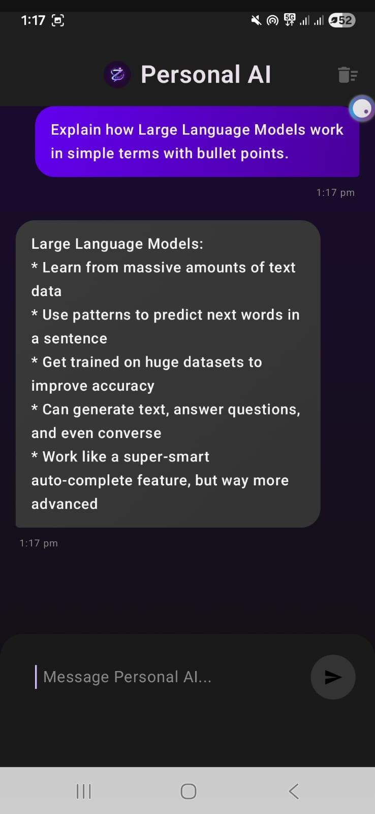
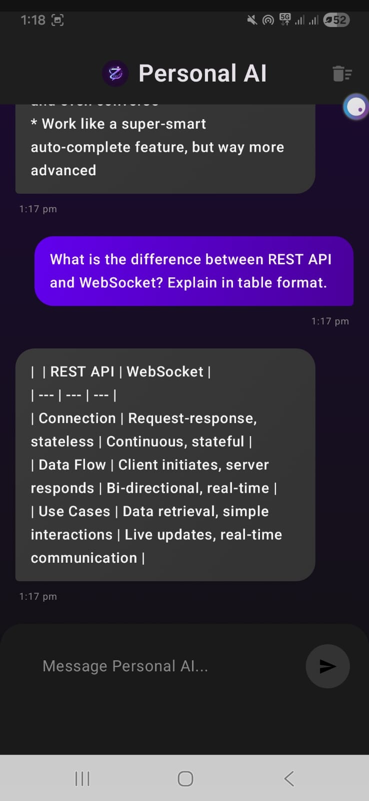
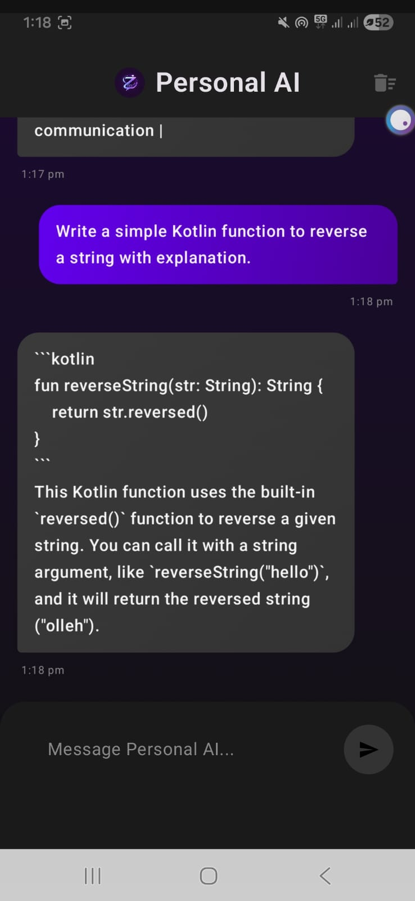

# 🤖 Personal AI Chat App

A modern AI-powered Android chat application built using Kotlin and Groq API.  
This app enables real-time conversations with an advanced LLM through a clean and responsive mobile interface.

## ✨ Features

- 🔹 Real-time AI responses
- 🔹 Conversation history support
- 🔹 Clean and modern dark UI
- 🔹 Secure API key handling
- 🔹 Smooth chat experience
- 🔹 Optimized network calls

## 🛠 Tech Stack

- Kotlin
- Android SDK
- Groq API (LLaMA 3 model)
- OkHttp for networking
- Gson for JSON parsing

## 📸 Screenshots

  
  
  

## 🔐 Security

API keys are stored securely using `local.properties`  
Sensitive files are excluded using `.gitignore`.

## 🚀 Setup Instructions

1. Clone the repository  
2. Add your Groq API key inside `local.properties`  
3. Build and run using Android Studio  

## 👨‍💻 Author

**Syed Ziyan**
